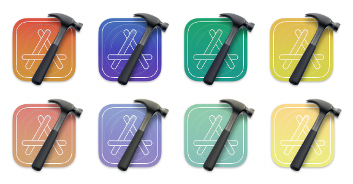
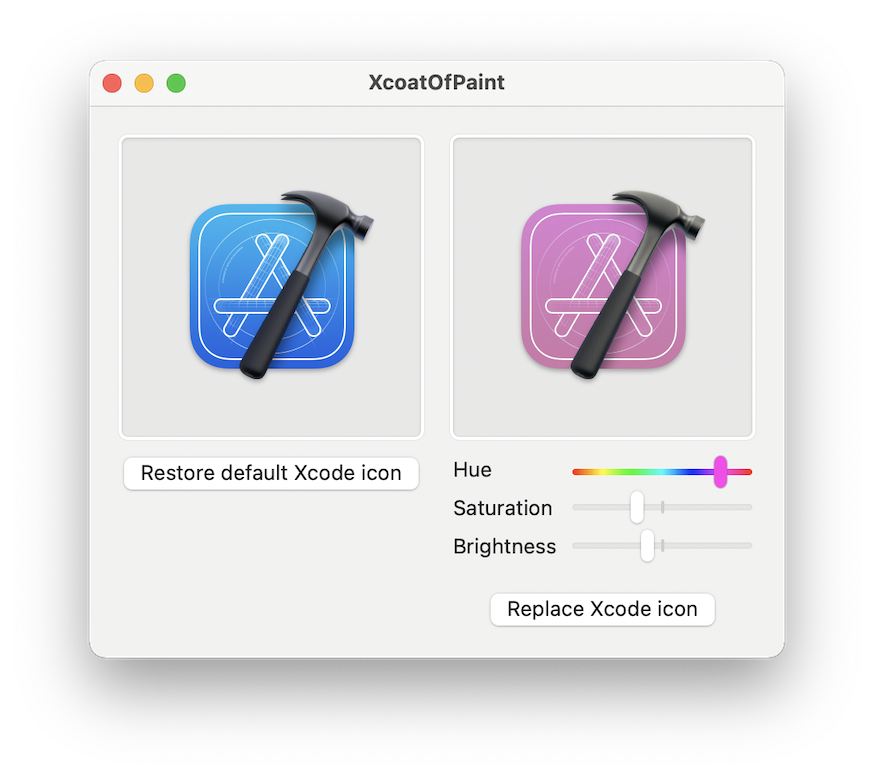

# XcoatOfPaint

Have you ever wished the Xcode icon could get a fresh coat of paint to match the colorful Mac you just bought?

## How to run
### Prebuilt release
Download the latest release from [GitHub](https://github.com/DerLobi/XcoatOfPaint/releases)

### Build from source
Just download the project and _"Build and Run"_ from Xcode.

## Usage

* Drag the Xcode app onto the left side of the app
* Change hue, saturation and brightness to your liking
* Click on "Replace Xcode Icon"

If you use an Xcode version that you directly downloaded from Apple's Developer website, the icon will be replaced automatically.

If you use the App Store version however, the app is owned by the "system" user, so we can't change it directly. An error message will appear and you can choose to open the "Get Info" dialog for Xcode. The new icon file is copied to the clipboard, so you can select the existing icon in the "Get Info" dialog and paste by pressing ⌘+v.

To restore the original icon, click on "Restore default Xcode icon" or, select the existing icon in the "Get Info" dialog and hit the delete key.

## License
[MIT License](https://github.com/DerLobi/XcoatOfPaint/blob/main/LICENSE)

## 3rd party components
* Color cube code taken from [https://github.com/trav-ma/TMReplaceColorHue](https://github.com/trav-ma/TMReplaceColorHue)